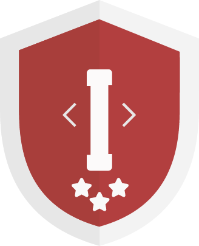

# Div 1 - McGill's ICPC Guide

<b>
Welcome to the repository for Compete McGill's Division I !
</b>

## What is ACM-ICPC

From [Official ICPC website](https://icpc.baylor.edu/) "The International Collegiate Programming Contest is an algorithmic programming contest for college students. Teams of three, representing their university, work to solve the most real-world problems, fostering collaboration, creativity, innovation, and the ability to perform under pressure. Through training and competition, teams challenge each other to raise the bar on the possible. Quite simply, it is the oldest, largest, and most prestigious programming contest in the world."

## Motivational lines from the Founder of CompeteMcGill

Computer science (CS) is a rich and powerful field that opens the door for you to work in an impactful and far-reaching industry that will help shape humanity's future in the next decades! Although many technologies exist today, many of them will fade away and new ones will emerge giving you an endless stream of new things to learn. However, most of the skills in CS converge into one main skill which is problem-solving. Competitive programming is basically a sport where people practice-problem by solving algorithmic challenges in a fun manner! By doing competitive programming you will build a very solid foundation in CS that will help you further on in your journey whatever it is, so buckle up and enjoy it!

## Contest rules and structure

* **Eligibility**: Need to be a full-time student in any program and not too old to participate. If you're 18-22 years old and studying full time in McGill then you should be fine. If concerned check [here](https://icpc.baylor.edu/regionals/rules) and for more info.
* **Programming languages allowed**: C/C++, Java, Python3, Python2, Pascal.
* **Cost**: Totally Free! CS department and CompeteMcGill will take care of the costs of the whole trip, so it's basically a free trip for you!

* **Team size**: 3 students with only one PC
* **Contest stages** relative to McGill teams:
    1) **Local stage** usually held at **McGill**, we are typically only allowed to move only 2 teams to next stage.
    2) **Preliminary Regionals** multiple contests held in the northeast part of NA. Around 4-5 are held in the US and one is held in Canada. We almost always aim to participate in a contest in the US since some of them are easier than others. So a US Visa or citizenship might be needed. Only one team move to the next stage.
    3) **Regionals** same as **Preliminary Regionals** except that it's definitely hosted in the US and big universities like MIT, Harvard, ... etc will be there.
    4) **World finals** held in a new country each year (Portugal for 2018). If you made it to this stage then companies will fight for your attention and internships will drop on you like rain. So congratulations my friend! No need to worry about the results of this contest nor prepare for any algorithmic interviews ever again, you have seen many of the hardest puzzles in CS.
    
        However, if your goal is not just to get a job, which is kind of expected for someone who reached this stage. If you end in the top 10 then I salute with all my heart, you made it to the top and will be rewarded with a medal and eternal glory, make sure to enjoy that to the max!

* **Reference Material**: You are allowed to bring textbooks, notes, slides ... or basically anything you might need for the contest. Usually, there is a limit to the number of pages you can bring (around 25 pages for world finals). See [Resources](##Resources) for examples of good references to bring to the contest.

## Training Schedule - Winter 2019

Training will be mostly done through solving problems either on online judges or from previous ICPC contests.

This section will be updated throughout the semester.

## How to join

Come to our events and chat with us or message us on facebook! Our social media profiles are:

* Facebook: [facebook.com/CompetitiveProgrammingMcGill/](https://www.facebook.com/CompetitiveProgrammingMcGill/)
* Instagram: [@competemcgill](https://www.instagram.com/competemcgill/?hl=en)
* Linkedin: [linkedin.com/company/competemcgill/](https://www.linkedin.com/company/competemcgill/)

You can also fill this [form](https://goo.gl/forms/qTHWgA2HRocCal2w2) to indicate your interest and we will contact you!

## Resources

### Textbooks (ordered by relevance)

* [Competitive Programming 3](https://cpbook.net/) By Steven Halim. (This is the bible of competitive programming!)
* [Competitive Programmer's Handbook](https://cses.fi/book/book.pdf)  by Antti Laaksonen (Draft).
* [Guide to Competitive Programming](https://www.springer.com/us/book/9783319725468) by  Antti Laaksonen.
* [Programming Challenges](https://www.amazon.ca/Programming-Challenges-Contest-Training-Manual/dp/0387001638) by Steven Skiena.

### Online judges (ordered by relevance)

* [Kattis](https://open.kattis.com/) Most popular platform in NA to competitive programming.

* [Codeforces](https://codeforces.com/) Popular among Russian programmers, has very good quality content.

* [UVA](https://uva.onlinejudge.org/) Old school judge with a huge collection of problems.
* [SPOJ](https://www.spoj.com/) Old school judge with hard tricky problems.
* [LeetCode](https://leetcode.com/) Mostly easy to medium problems, popular for tech interview preparation.

### References and Cheatsheets

* [Stanford University ICPC Team Notebook (2015-16)](https://cs.stanford.edu/group/acm/SLPC/notebook.pdf) Newer versions might exist.
* [MIT ACM Reference 2008](http://web.mit.edu/~ecprice/acm/notebook.pdf) Newer versions might exist.

* [methodstosolve](https://cpbook.net/methodstosolve), it contains hints for solving problems in several online judges including UVA and Kattis.

## Other Competitive programming contests

* [Google Code Jam](https://codingcompetitions.withgoogle.com/codejam)

* [Facebook HackerCup](https://www.facebook.com/hackercup/)

## Executive Members of CompeteMcGill

Special thanks to the amazing people behind CompeteMcGill who without them this wouldn't be possible. They dedicate a huge amount of time every week to make sure that the whole experience is enjoyable and fun for everyone! Namely a huge shoutout to:

* **Imad Dodin** as VP Competitions
* **Zachary Feng** as VP Media & Communications
* **Afreen Aliya** as VP Events
* **Kelvin Tagoe** as VP Finance
* **Andrea Hyder** as VP Internal
* **Parth Khanna** as VP External
* And everyone in the subcommittees who helped us make this happen!

---
By **Andre Kaba**, President of CompeteMcGill (2018-2019)